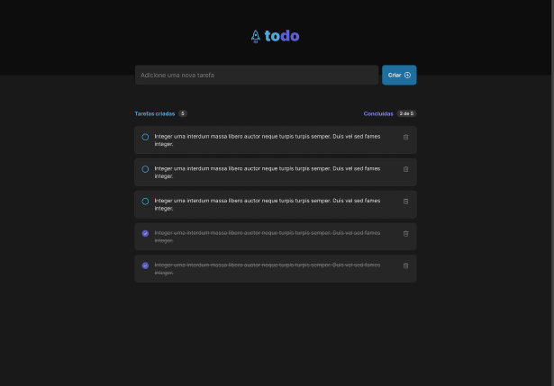

<h1 align="center">
  
</h1>



## Aplicação

Uma simples aplicação para criar lista de tarefas, podendo também marcar como concluída ou deletar.

## Features

- Adicionar uma nova tarefa
- Marcar ou Desmarcar como concluída
- Deletar uma tarefa

## Tecnologias

- [React](https://pt-br.reactjs.org/)
- [Typescript](https://www.typescriptlang.org/)
- [Phosphor-react](https://phosphoricons.com/)
- [uuid](https://www.npmjs.com/package/uuid)

Para padronizar o código configurei

- [Prettier](https://prettier.io/)
- [ESLint](https://eslint.org/)
- [Husky](https://github.com/typicode/husky)
- [Lint-staged](https://github.com/okonet/lint-staged)

## Executando o projeto

Utilize **npm install** para instalar as dependências do projeto.
Em seguida, inicie o projeto.

```
npm run dev
```

### **Projeto desenvolvido por**

[](https://www.linkedin.com/in/joilsonmslopes/)

### **Projeto do desafio 01 - Fundamentos React - Ignite**

[](https://www.linkedin.com/school/rocketseat/)
